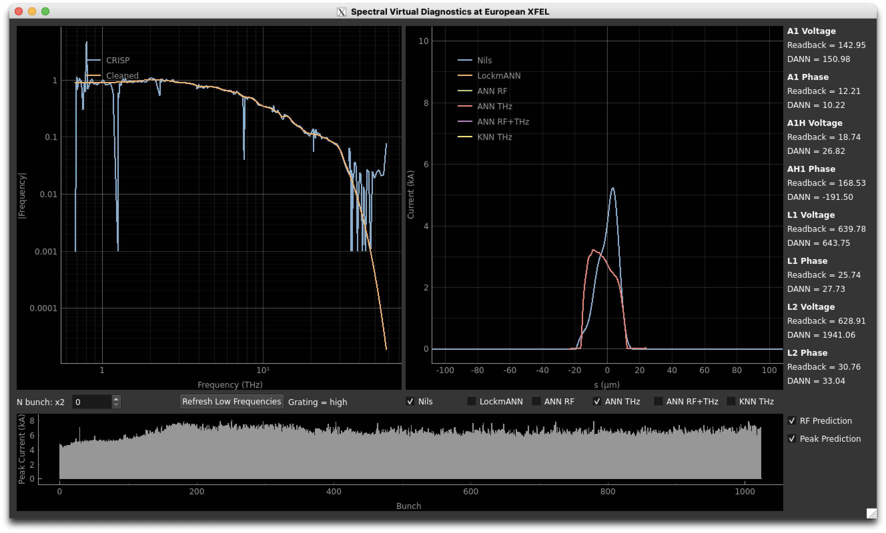

# Spectral Virtual Diagnostics and European XFEL

Virtual Diagnostics for inferring current profiles of bunches at European XFEL.

## A quick overview of the app

Below you can find a screenshot of the app in operation. The following features are available:

 - **Reading THz radiation from CRISP:** The THz radiation is shown in both raw and clean form in the plot on the left. Below this plot you can select the bunch of which the CRISP reading is displayed (and used throughout the app) as well as update the low frequency reading by having the app automatically change the grating back and forth.
 - **Current profile reconstruction:** The plot on the right displays current profile reconstructions by by different algorithms. You can choose which reconstructions are displayed using the checkboxes below. If algorithms use THz radiation for the reconstruction, they consider the bunch selected in the THz radiation plot.
 - **Reverse RF inference:** On the very right you can see the current RF parameter readbacks as well as RF parameters that an artificial neural network (ANN) believes are the true RF parameters. For its prediction, it uses both the RF readbacks and the THz radiation. The prediction can be toggled on and off via the *RF Prediction* checkbox below.
 - **Bunch train peak inference:** The bottom plot shows peak currents of bunches along the bunch train as reconstructed by an ANN. You can activate and deactivate this prediction using the *Peak Prediction* checkbox. Note that unlike all other displays in this app, the peak plot remains visible when the peak prediction is inactive. It will, however, stop to update.

At the current stage of development there remain a handful got "gotchas" with this app:
 
 - The machine learning may currently be inaccurate on the real accelerator as they have been on an outdated simulation setup. This applies to current profiles, RF parameters and peak currents.
 - The app hasn't yet been optimised for speed. If you find the app to be running slowly, try turning some of the predictions off. The peak prediction in particular is very expensive to compute.



## How to run the app in BKR

**NOTE: Due to a PyDoocs update you might have to upgrade from Python 3.7 to 3.9 if you have an older environment!**

There are two ways to run the app in BKR. You can either run it remotely via one of the `xfeluser` servers or locally on either a macOS or Linux console. The first option is probably quicker to get up and running, whereas the latter probably runs more smoothly.

### Via `xfeluser` server

To run remotely simply connect to one of the `xfeluser` servers

```bash
ssh username@xfeluser2
```

activate my Anaconda environment

```bash
conda activate /home/kaiserja/.conda/envs/spectral-vd
```

and start the app

```bash
python /home/kaiserja/spectral-vd-euxfel/app.py
```

### Locally on console

If you are running on a local Linux console you may be able to activate the environment and run the app as you would on the `xfeluser` servers (see above). On a macOS console you will have to create a suitable Anaconda environment. You can create an Anaconda environment on Linux as well, if you wish to do so.

In order to create a new Anaconda environment that is configured correctly, run the following commands in order:

```bash
git clone https://github.com/jank324/spectral-vd-euxfel.git
cd spectral-vd-euxfel
conda create --name spectral-vd python=3.9
conda activate spectral-vd
pip install requirements.txt
```

Then run

```bash
python app.py
```

to run the app.
